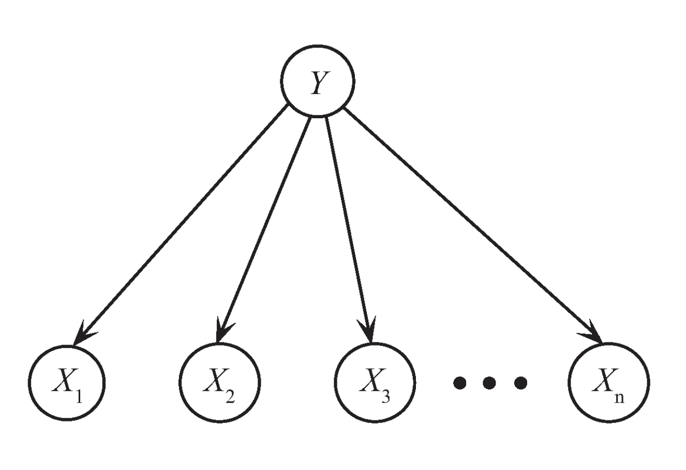
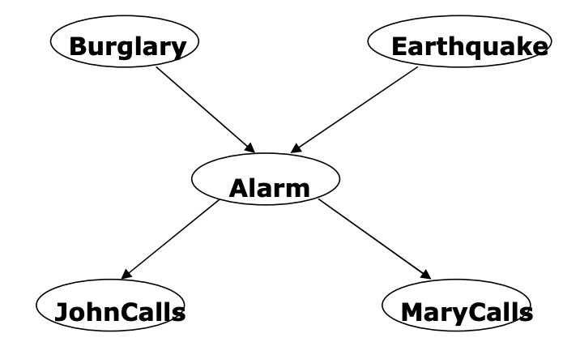
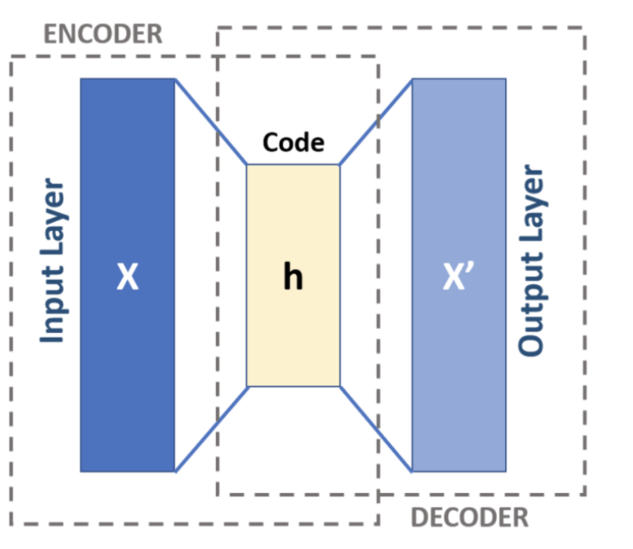
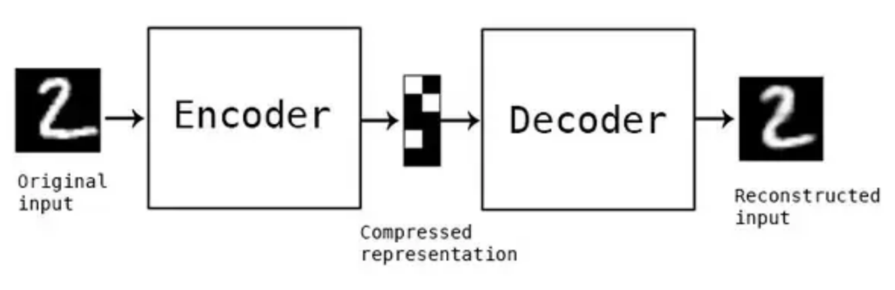
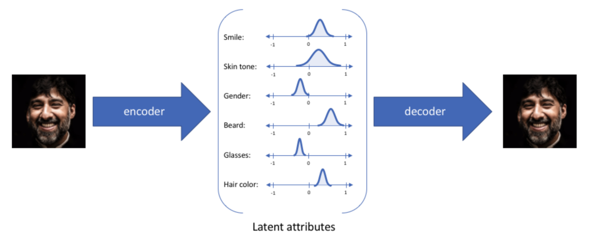
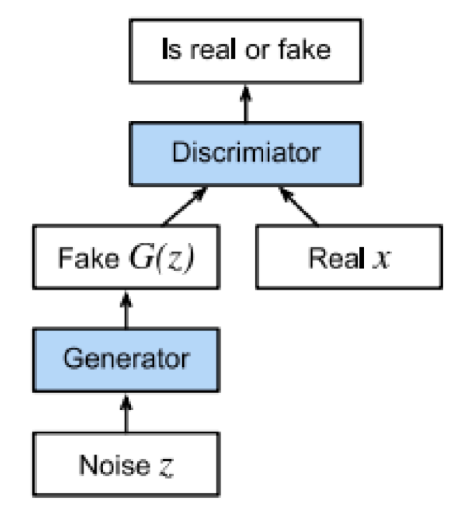

# Generative Models

## Why are we interested in Generative Models?

Till now we've been modelling $P(Y|X)$. Generative Models have the general form $P(X,Y)$

If we are able to build a generative model then we can build a classifier out of that generative model really easily as so:

$$P(Y|X) = \frac{P(X,Y)}{P(X)}$$

Here, $P(X)$ can be substituted with $\sum_{y}(P(X,Y))$. Finally giving us:

$$P(Y|X) = \frac{P(X,Y)}{\sum_{y}P(X,Y)}$$

The ideal goal is to be able to model $P(X_1, X_2, X_3, ..., X_d, Y)$

$$P(X_1, X_2, X_3, ..., X_d, Y) = P(X_1, X_2, X_3, ..., X_d|Y)P(Y)$$

If $X_1, X_2, ... X_d$ are conditionally independent given $Y$, then the above equation simplifies to:

$$P(X_1, X_2, X_3, ..., X_d, Y) = P(X_1|Y)P(X_2|Y)P(X_3|Y)...P(X_d|Y) P(Y)$$

Or,

$$ P(X_1, X_2, X_3, ..., X_d, Y) = P(Y)\prod_{i=1}^{d}P(X_i|Y)$$

The assumption of the variables being class conditionally independent is called the _Naive Bayes Assumption_.
Since our end goal was to build a classifier from this generative model, we can use the generative model as so:

$$P(Y=0|X_1,X_2...X_d) \propto P(Y=0,X_1,X_2...X_d)$$
$$P(Y=1|X_1,X_2...X_d) \propto P(Y=1,X_1,X_2...X_d)$$

We know that the constant term in both these equations is going to be the same (i.e., the denominator term from the Bayes equation)
So if we assume the constant term to be $\alpha$ to get rid of the proportionality and add the equations, we get:

$$\alpha = \frac{1}{P(Y=0,X_1,X_2...X_d)+P(Y=1,X_1,X_2...X_d)}$$

Hence the naive bayes classifier equation becomes:

$$P(Y=0|X_1,X_2...X_d) = \frac{P(Y=0,X_1,X_2...X_d)}{P(Y=0,X_1,X_2...X_d)+P(Y=1,X_1,X_2...X_d)}$$
$$P(Y=1|X_1,X_2...X_d) = \frac{P(Y=1,X_1,X_2...X_d)}{P(Y=0,X_1,X_2...X_d)+P(Y=1,X_1,X_2...X_d)}$$

Both the probabilities in the denominator are joint pdfs and can be obtained from the generative model.

### Structure and Params

The Structure of the Naive Bayes Classifier is a DAG (short for Directed Acyclic Graph) and the parameters would be the conditional
probabilities. The parameters could be esimated using MLE or using just the priors. 
But where are the priors in a Naive Bayes Classifier? The priors are encoded by the relationships between the variables and the variable 
which is assumed to be given (e.g. $Y$). So for each such relationship (e.g. $X_1|Y$), there can be two priors - one encoding the prior
in the case $Y=0$ and the other encoding the prior in the case $Y=1$. Hence, if we are modelling P(Y|X_1, X_2, ..., X_d) then there are 
$2\ \times\ d$ priors for the conditionally independent variables and a prior for $Y$ itself giving us a total of $2\ \times\ d + 1$ 
priors.

# Bayesian Network

Bayesian Networks are a type of model where the structure is a DAG such that the random variables encoded in it satisfy the
Markov Condition. 

For a network like the above, we will require a total of 10 priors ($1+1+4+2+2$)

Node  | Parents | Non-Descendents
----- | ------- | ---------------
B | $\phi$ | $\phi$
E | $\phi$ | $\phi$
A | B, E | $\phi$
J | A | B, E, M
M | A | B, E, J

Note that we dont include parents in its non-descendents.

## Markov Condition

The Markov Condition states that a random variable $X$ is a conditionally independent of its non-descendents given Parents.

* $X$ is a parent of $Y$ if there is an edge $X \rightarrow Y$.
* $Y$ is a descendent of $X$ if there is an edge $X \rightarrow Y$.
* $Y$ is a non-descendent of $X$ if there is no path from $X$ to $Y$ and $X$, $Y$ do not have a parent-child relationship.

If we know the Markov Condition holds, we should be able to answer any conditional query fairly easily using the joint distribution
over all the variables

$$P(B,E,A,J,M) = P(B)P(E)P(A|B,E)P(J|A)P(M|A)$$

## Selecting a Graph

### What was before BIC?

### BIC

# Neural Network based Generative Models

## Autoencoder

An autoencoder (AE) is a neural network that learns to copy its input to its output. The internal representation between 
the encoder and the decoder is commonly called as the _code_ or the _latent vector_ of that input sample.

AE reconstructs the input _approximately_ to preserve the most relevant parts of the data i.e., some important __latent__ 
aspects.

Let __x__ be an input example. The encoder maps $Enc: \mathcal{X} \rightarrow \mathcal{H}$ and the decoder maps 
$Dec: \mathcal{H} \rightarrow \mathcal{X}$. The encoder and decoder functions are obtained by minimising a reconstruction
loss:

$$Enc, Dec\ =\ argmin_{Enc, Dec} \| \ x \ -\ (Dec \cdot Enc)(x) \|^{2}$$

In the simplest case, both encoder and decoder are single layered. That is,

$$h\ =\ \sigma (wx\ +\ b)$$

Usually there is a regularization term added to the loss so that the encoder and decoder do not collapse into an identity function.
__h__ is referred to as the _code_ or the _latent_ variable or the _latent_ representation.

The idea is that each hidden dimension represents some latent feature learned about the input. For example, for an autoencoder 
made to reconstruct human faces, it might learn features such as smile, skin tone, gender, beard, etc. Ofcourse, this is just to give an 
example. In actuality it may end up learning latent features that may not necessarily be even understandable to us.

An autoencoder is a __discriminative__ model. It can be used for:
* compressing data
* greedy layer wise pre-training
* cannot be used for generating new data.

The greedy way of pre-training is basically that we first train an autoencoder with encoder and decoder of only size 1. Then we keep 
adding layers and only train the new layers. This was very important back in the day when there was not a lot of compute at hand.

__For generating new data, the model needs to learn a join distribution $p(x)$ or $p(x,h)$__
Or, a model can be considered to be generative when the latent variable has a probability distribution associated with it - a kind 
of autoencoder that is called as a Variational Autoencoder.

In such a case, the encoder network is usually called as the _recognition_ model and the decoder network is called as the _generative_ 
model.

For the complete dataset, the VAE would output a range of values for each latent dimension hence creating a statistical distribution
in each of those dimensions. Ideally, a very minute difference between the sampled points should result in the same output being created 
from the generative model.

### Variational Inference

## Limitations

# Generative Adversarial Networks (GAN)

Generative Model  | Discriminative Model
----------------- | --------------------
Estimates the joint probability $p(x,y)$.  | Estimates the conditional probability $p(y|x)$ of the label _y_, given data instance _x_ (e.g. MLP, CNN).
It can be used in a supervised and an unsupervised setting  | It can be only used in a supervised setting
The goal of the generative model is to synthesize data instances that are so realistic that it is hard for an observer to say it is synthetic i.e., $D(x^\prime) \approx 1$ | The goal of the Discriminative Model is to classify correctly real examples from training data from synthetic samples created using the generative model.
$max_G(-(1-y)log(1-D(G(z))))$ where $z \sim \mathcal{N}(0,1)$   | $min_D(-ylog(D(x)) - (1-y)log(1-D(x)))$
The term *__adversarial__* is used as the goals of the discriminator and generator is to fool each other.

## Training

The final objective is 

$$min_D \ max_G \{- \textbf{E}_{x \sim \mathcal{X}}(logD(x)) - \textbf{E}_{z \sim \mathcal{N}(0,1)} (log(1 - D(G(z)))) \}$$

The solution is actually a saddle point here due to the combined minimization and maximization here. In game theoretic terms, it is a nash equlibrium.

