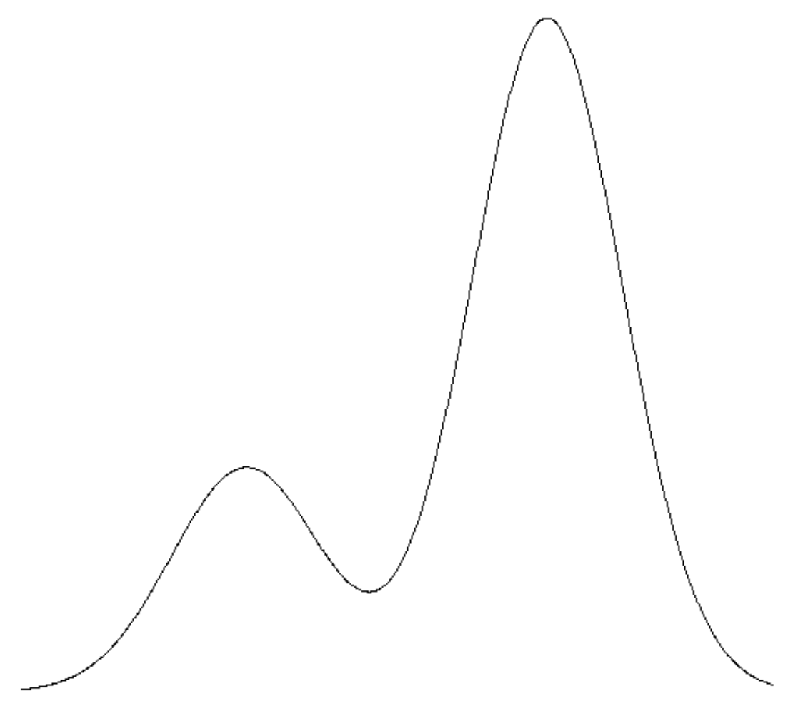

# Clustering

Our visual system performs clustering in an unsupervised manner all the time. For instance, when you're looking at a laptop, you're not thinking
of its individual parts but rather the individual components such as the keyboard, screen together as a laptop.

Lets consider data instances $X_1, X_2, ..., X_n$. How many non overlapping clusters can be formed from this?

The answer which is the Bell's Number comes from combinatorial math from a similar question - How many partitions exist of a set?

The only difference between these two is that in clustering we wouldnt care if the data instances are so close that they are 
considered identical -- which is something that we want to learn. At the heart of clustering is a notion of similarity or distance
between objects, as we want to group similar instances together.

#### Minkowski Distance

$$ D_p(x,y) = (\sum_{i=1}^{d}\| x_i - y_i \|^{p})^{\frac{1}{p}} $$

Minkowski distance is the euclidean distance for $p=2$ and the manhattan distance for $p=1$. As p becomes larger, $max(|x_i - y_i|)$ 
becomes dominant.

## Nearest neighbour Classifier

Suppose you've seen some data instances and now we want to find the $y$ value of a new instance $x\prime$. In the nearest neighbour
classifier, we find the nearest neighbour and assign $y$ of the new instance $x\prime$ to be the $y$ of the nearest neighbour.

An alternative to this is using the average of $k$ nearest neighbours.

A problem with such a classifier (other than storage) is that it is dependent on the order in which the data instances are seen.
The main difference between clustering and classification is that we dont know $y$ in clustering.

## Probabilistic Clustering

### Naive Bayes Clustering

For each data instance, we associate a fractional weight i.e., a probability with each class.

Instance | $X_1$ | $X_2$ | $X_3$ | $X_4$ | Y | Count
-------- | ----- | ----- | ----- | ----- | - | -----
1a | 0 | 1 | 1 | 1 | 1 | 0.4
1b | 0 | 1 | 1 | 1 | 2 | 0.1
1c | 0 | 1 | 1 | 1 | 3 | 0.5

With probabilitic clustering, we are simply done. We interpret this as a $40\%$ chance instance 1 belongs to cluster 1 and so on.
This is also called as _Soft Clustering_.

The initial counts is a problem, but we would usually update the initial counts based on the data we've seen. The algorithm we to update
the counts is known as the **_Expectation Maximization_** Algorithm.

### Gaussian Mixture Model

In GMM based clustering, we will be dealing with data that is coming from a mixture of probability distributions. An example of such data
is shown below 

Let us assume the first distribution is A and the second is B. Given a point, we can determine the probability that it 
came from either A or B. In some sense, every point belongs to every cluster with a probability. In practise, we will be given several 
points and we will have to _construct_ these distributions.

In this case, if we know $\mu_a, \sigma_a$ and $\mu_b, \sigma_b$, then calculating $P(X=x|A)$ and $P(X=x|B)$ is straightforward.

$$ P(A|X=x) \propto P(X=x|A)P(A) $$

Let us assume we know the prior $P(A)$. The clustering problem here is that we don't know $\mu, \sigma$ for each of these distributions.
If $\mu, \sigma$ are known, then we are done.

Here there are 4 unknowns: $\mu_a, \sigma_a$ and $\mu_b, \sigma_b$. Not in saying this we are assuming that there are only 2 distributions.
And that they are normal.

#### Procedure

1. Randomly guess $\mu_a, \sigma_a, \mu_b, \sigma_b, P(A)$. Note: $P(B) = 1 - P(A)$.
2. Using these guesses calculate the probability that each of these points belong to A and the probability that each of these belong to B.
3. Similarly we do this for every point and finally we can calculate the mean $\mu_a = \frac{\sum_{i=0}{d} w_{i,A}x_i}{N}. We can 
calculate the other required parameters similarly.
4. With these parameters, we can calculate the likelihood of the given data using the gaussian pmf function. The likelihood would simply
be the product of the probabilities of the individual data points being produced given the the parameters of the gaussian calculated in 
Step 3.

A possible stopping criterion is to stop when the likelihood stops increasing/changing. But this does not guarantee convergence to 
_optimal_ clustering.

If we generalize this to higher dimensions, we can instantly see that this would require estimation of a lot of parameters especially 
terms in the covariance matrix. Hence, much more data is required. As mixture models dont scale with high dimensions, we usually need
some approximation to mixture models that scales well with higher dimensions.

### k-means clustering

Here, each point belongs to a single cluster and membership is determined based on distance rather than a probability.

Clusters are described entirely by the mean.

#### Procedure

1. Randomly assign k means. Say $\mu_1,\mu_1,...\mu_k$.
2. For each iteration:
    a. for every point x
        i. Compute distance to means.
        ii. Assign to closest mean
    b. Recompute mean based on cluster assignments.

Similar to the EM Algorithm, this procedure does not alone guarantee convergence. If we think about this as an optimization algorithm, 
we need to minimize the sum of squares of each point to its closest mean i.e.,

$$ L = \sum_{i=1}^{N} \sum_{j=1}^{k} z_{ij} |x_i - \mu_j|^2  $$

where $z_{ij} = 1$ if $x_i$ belongs to cluster $\mu_j$ and $0$ otherwise.

So if the means of the cluster do not change after an iteration, it can be stopped as it may not be able to do any better. This is 
because the loss function of each cluster is at the minimum and the overall loss function is also minimum.

The limiting case is when $k=n$ and each cluster is itself. This is not useful, but the loss is $0$.

Usually such a situation can be prevented by having a regularization term that penalizes when new clusters are created.

#### Assumptions (and Drawbacks)

* k-means works best and is useful when the data is spherically distributed around the mean (But this can be resolved by data pre-processing).
* larger clusters tend to dominate and pull in scattered points further increasing their size. Hence, k-means is suitable for 
evenly sized clusters.

## Hierarchical Clustering

We can do this in a top down manner i.e., we start with all instances in a single cluster or in a bottom-up manner where we start with 
each instance as a single cluster.

### Top-Down Clustering

### Bottom-Up Clustering (Agglomerative)

