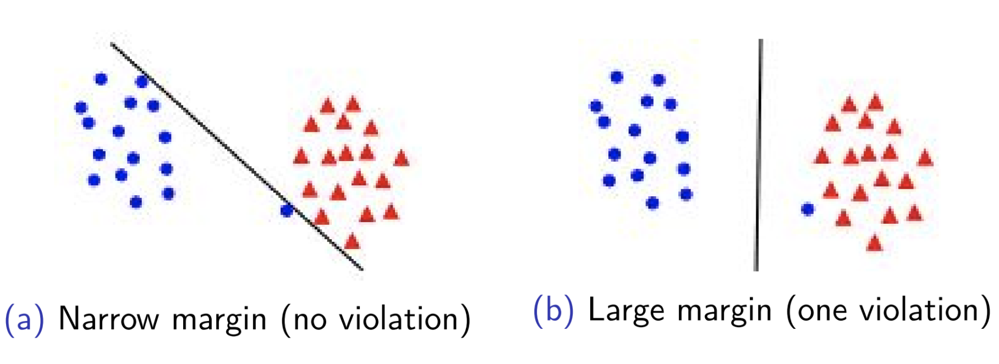
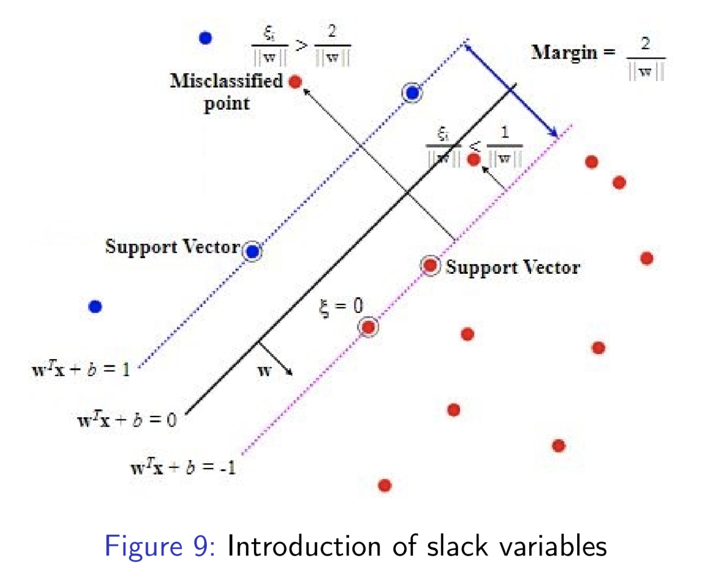

# Support Vector Machines

## Constraint Violation

At times, having a hard constraint may not be so useful especially when there are outliers or noise in the dataset. In 
such a case we allow for the constraints to be minimally violated. An example is show below:

To introduce this effect, we add slack variables to our model which allow constraint violation. The slack variable $\xi_i 
\in [0,1)$ enables the point $x_i$ to be in between the margin and on the correct side of the hyperplane.
This is called __margin violation__. If $\xi_i > 1$, then the point is misclassified.

The corresponding objective function of the SVM becomes:

$$ \min_{\textbf{w}\in\mathop{\mathbb{R}}^d, \xi\in\mathop{\mathbb{R}}^+} \| \textbf{w} \|^2 + C\sum_{i}^{N}\xi_i $$

subject to:

$$ y_i\{w^Tx+b\} \geq 1 - xi_i\ ;\ \forall\ i=1...N $$

## KKT Conditions
* _Stationarity_: Calculate the lagrangian and set its differential wrt each variable to $0$.
* _Complementary Slackness_: Multiplication of multiplier and the $h(x)$ condition is 0.
* _Primal Feasibility_: $h(x) \leq 0$, $l(x) = 0$.
* _Dual Feasability_: Multipliers are greater than $0$.

